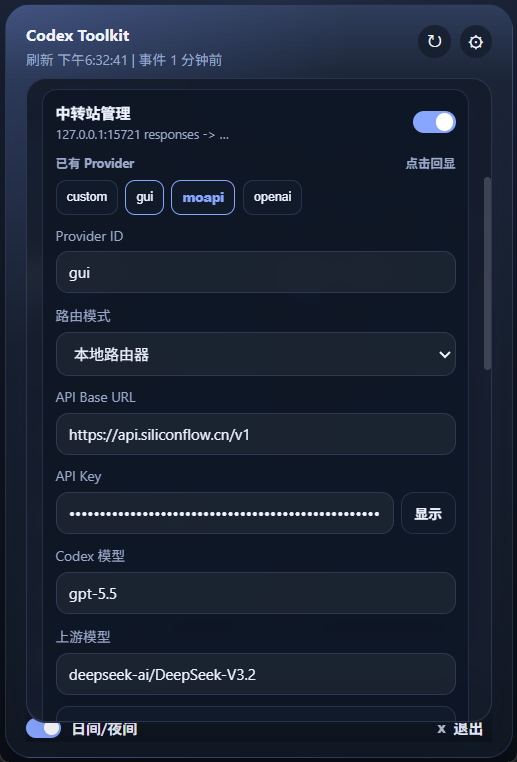
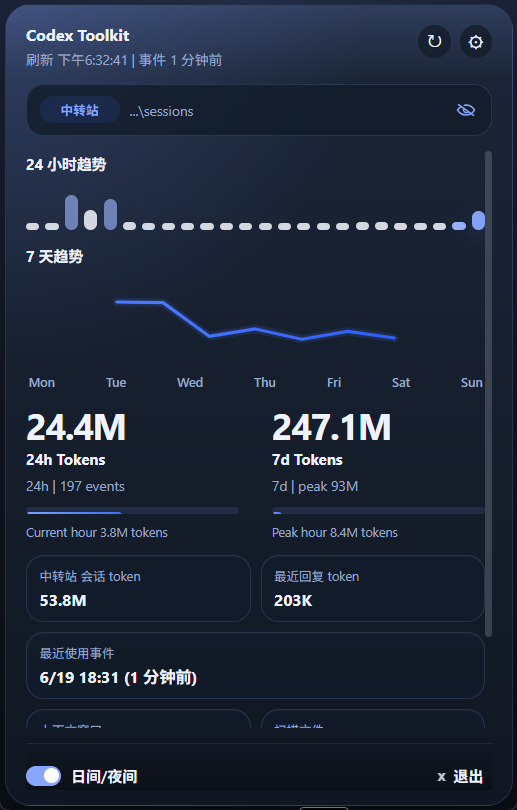
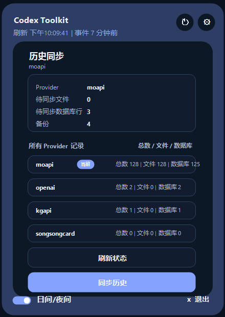
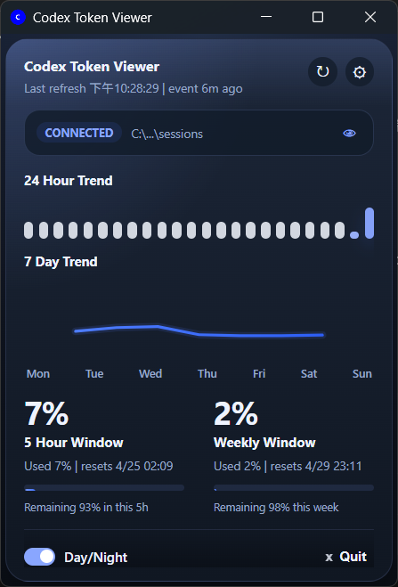
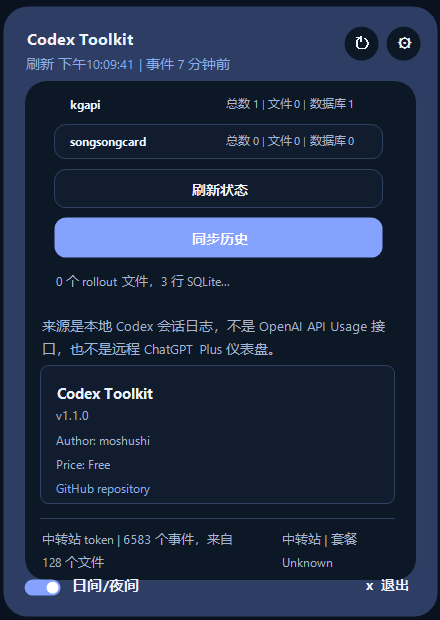

# Codex Toolkit

<p align="center">
  <strong>A local-first desktop toolkit for Codex usage monitoring, relay provider management, and history sync.</strong>
</p>

<p align="center">
  <a href="./README.md">中文</a> | English
</p>

<p align="center">
  
</p>

<p align="center">
  <a href="#quick-start">Quick Start</a> |
  <a href="#features">Features</a> |
  <a href="#relay-management">Relay Management</a> |
  <a href="#history-sync">History Sync</a> |
  <a href="#development">Development</a>
</p>

Codex Toolkit reads local Codex session logs, turns token usage into a compact desktop dashboard, and summarizes historical usage by provider. When Codex uses a relay-backed provider, the app rebuilds 24-hour and 7-day token trends from local `token_count` events, so you can still inspect local usage even when official quota fields are unavailable. It can also manage Codex API/provider configuration, so you can switch between the official route, direct relay routes, and the local router route without editing `~/.codex/config.toml` by hand. When needed, it can also sync historical session provider markers to the current route.

Local router mode lets Codex keep speaking the Responses API to `http://127.0.0.1:15721/v1`, while Codex Toolkit converts requests locally to a Chat Completions upstream. This makes DeepSeek, SiliconFlow, OpenRouter, and other `/chat/completions`-compatible providers usable from Codex.

Currently tested mainly on Windows. macOS compatibility has not been fully verified yet, and issue reports are welcome.

## Screenshots

<p>
  
  
  
</p>

<p>
  
  
  
</p>

## Quick Start

```bash
npm install
npm run dev
```

Build desktop installers:

```bash
npm run build
```

Build outputs are generated under:

- `src-tauri/target/release/bundle/msi`
- `src-tauri/target/release/bundle/nsis`
- `src-tauri/target/release/bundle/dmg`
- `src-tauri/target/release/bundle/macos`

## Features

| Area | What you get |
| --- | --- |
| Token dashboard | Current session totals, last response usage, trend views, context window size, provider token totals |
| Rate-limit view | 5-hour and weekly usage windows based on local Codex session logs |
| Relay token trends | 24-hour hourly token buckets and 7-day token totals reconstructed from local `token_count` events when using a relay provider |
| Relay management | Provider ID, API Base URL, API Key, direct Responses route, local router, Chat Completions upstreams, provider self-test, apply config, restore official, apply and restart |
| History sync | Review provider history counts and sync session files plus local SQLite history to the current provider |
| Desktop behavior | Tray minimize/restore, login autostart, edge snapping, privacy mode |
| UI | English/Chinese menu switching and day/night theme toggle |

## Relay Management

Codex Toolkit stores relay settings locally, then writes them to Codex only when you apply the configuration.

With the default Provider ID `moapi`, the generated Codex config looks like:

```toml
model_provider = "moapi"

[model_providers.moapi]
name = "moapi"
wire_api = "responses"
requires_openai_auth = true
base_url = "https://your-relay.example.com/v1"
experimental_bearer_token = "sk-..."
```

The Provider ID is editable. If you set it to `myrelay`, Codex Toolkit writes:

```toml
model_provider = "myrelay"

[model_providers.myrelay]
name = "myrelay"
wire_api = "responses"
requires_openai_auth = true
base_url = "https://your-relay.example.com/v1"
experimental_bearer_token = "sk-..."
```

Before writing, the existing Codex config is backed up as:

```text
config.toml.codexviewer-backup-YYYYMMDD-HHMMSS
```

Restore official removes the active toolkit-managed provider, the default `moapi` provider, and the legacy `CodexViewerRelay` provider if present.

### Local Router Mode

Use local router mode when an upstream provider is OpenAI Chat Completions compatible but does not directly support the Responses API expected by Codex.

In local router mode, Codex is still configured as a Responses provider and points to the local gateway:

```toml
model_provider = "gui"

[model_providers.gui]
name = "gui"
wire_api = "responses"
requires_openai_auth = true
base_url = "http://127.0.0.1:15721/v1"
experimental_bearer_token = "codex-toolkit-local-router"
```

The real upstream URL, API key, and upstream model stay in the Codex Toolkit provider profile instead of being written directly into Codex config. For example:

```text
Codex -> http://127.0.0.1:15721/v1/responses
Codex Toolkit -> https://api.siliconflow.cn/v1/chat/completions
Upstream model -> deepseek-ai/DeepSeek-V3.2
```

The local router handles:

- Responses request to Chat Completions request conversion
- Chat Completions streaming output to Responses SSE conversion
- `reasoning_content`, `reasoning`, and `<think>...</think>`
- non-streaming and streaming tool calls
- `function_call_output` tool result round trips
- `response.completed`, `response.failed`, `incomplete`, and normalized upstream errors

The "Test provider" button in the relay panel tests the current provider without changing Codex config, including local router health, upstream non-stream requests, and upstream streaming requests.

## History Sync

The history sync panel reads the current Codex provider and counts provider records from:

- rollout session files under `~/.codex/sessions` and `~/.codex/archived_sessions`
- thread rows in `~/.codex/state_5.sqlite`
- backups created by the toolkit history sync flow

Clicking "Sync history" updates historical sessions that do not match the current provider and updates local SQLite thread rows. Before syncing, Codex Toolkit backs up the original session metadata, `state_5.sqlite`, Codex config, and global state files under:

```text
~/.codex/backups_state/toolkit-history-sync/YYYYMMDDTHHMMSS.sssZ
```

If older histories contain `encrypted_content` from another provider, the panel shows a warning: sync can restore list visibility, but continuing those sessions may still be affected by provider-specific encrypted content.

## How Data Loading Works

The app:

1. Resolves the Codex sessions directory
2. Recursively scans `.jsonl` files
3. Reads `model_provider` from the first-line `session_meta`
4. Extracts `token_count` events
5. Reads the current toolkit-managed Codex provider status
6. Builds the latest token snapshot, trend series, and provider token summaries
7. Uses official rate-limit percentages for the official route
8. Uses self-computed 24-hour and 7-day token buckets for relay-backed routes
9. Labels usage as official or relay-backed
10. Renders the result in the desktop UI

Default log location:

```text
~/.codex/sessions
```

You can override the log directory from the settings panel.

## Why It Exists

OpenAI's public API usage endpoints are designed for organization billing and API usage, not local Codex desktop session analytics. Relay providers also differ in how they expose usage data.

Codex Toolkit focuses on local Codex usage reconstruction by reading session log files already available on your machine, then shows history distribution from each session's provider metadata and your current Codex route.

## Development

Requirements:

- Node.js 20+
- Rust toolchain with `cargo`
- Windows: Microsoft Visual Studio C++ Build Tools
- macOS: Xcode Command Line Tools

Useful checks:

```bash
cargo test --manifest-path src-tauri/Cargo.toml
npm run build
```

Frontend syntax-only check on Windows:

```powershell
$tmp = Join-Path $env:TEMP 'codex-toolkit-renderer-check.mjs'
Copy-Item src\renderer.js $tmp -Force
node --check $tmp
```

Detailed release notes are tracked in [CHANGELOG.md](./CHANGELOG.md).

## Release Automation

This repository includes two GitHub Actions workflows:

- `CI`: runs tests and verifies the app builds on pushes and pull requests
- `Release`: builds Windows and macOS bundles and uploads them to GitHub Releases when you push a version tag like `v1.0.0`

Latest fix release:

- `v1.2.0`: adds local router mode so Codex can use Chat Completions upstreams through the Responses API, including reasoning, tool calls, tool result round trips, and provider self-tests.

Example release flow:

```bash
git tag v1.0.0
git push origin main
git push origin v1.0.0
```

## Platform Notes

- Windows release artifacts are generated as `.msi` and `setup.exe`
- The Windows release executable uses the GUI subsystem, so it does not open a console window
- macOS release artifacts are generated as `.dmg` and `.app`
- macOS signing and notarization are not configured yet, so Gatekeeper warnings may still appear on first launch

## Privacy

Codex Toolkit reads local session logs and the local Codex SQLite state database from your machine. It does not call the public OpenAI organization usage API to populate the dashboard.

API keys are stored locally in the toolkit settings file and written to Codex config only when you apply relay settings. History sync rewrites local session metadata and local SQLite provider markers, with automatic backups before changes are applied. Avoid sharing screenshots that reveal full local paths or sensitive relay details; use the built-in privacy toggle when needed.

## Contributing

Please read [CONTRIBUTING.md](./CONTRIBUTING.md) before opening a pull request.

## License

[MIT](./LICENSE)
